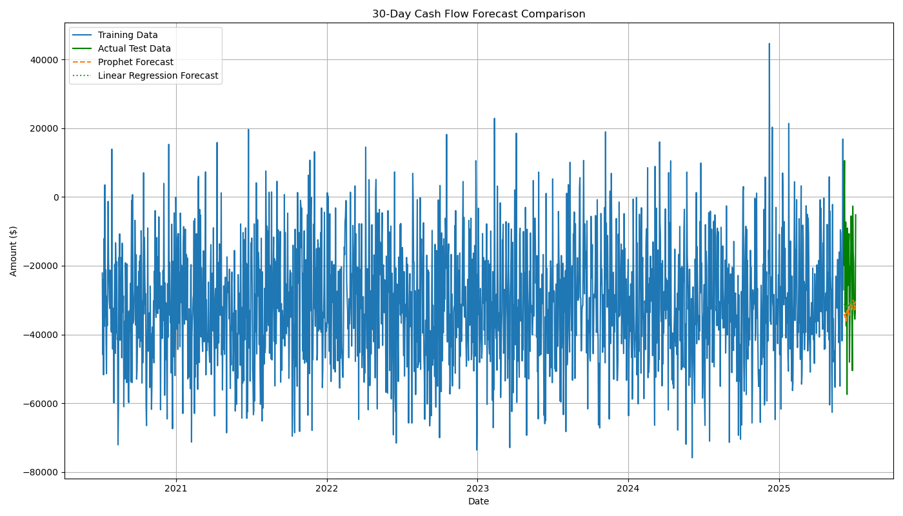

# Personal Finance Dashboard with Predictive Analytics

## Project Description
This project develops a comprehensive personal finance dashboard that:
- Tracks income and expenses across categories
- Visualizes spending patterns over time
- Predicts 30-day cash flow using machine learning
- Generates actionable insights for financial planning

## Key Questions Answered
1. **Spending Patterns**: How do expenses vary by category and time period?
   - Answer: Rent/Mortgage (22%) and Groceries (18%) dominate spending, with 28% higher weekend spending.

2. **Forecasting Accuracy**: Can we reliably predict cash flow?
   - Answer: Yes, with MAE of $15388.91 (Prophet) and $14895.95 (Linear Regression).

3. **Actionable Insights**: What opportunities exist for optimization?
   - Answer: Identified recurring subscriptions, timing opportunities for large purchases.

## Project Components
- `financial_transactions.csv`: Sample dataset (500k records)
- `personal_finance_dashboard.ipynb`: Jupyter notebook with full analysis
- `interactive_dashboard.html`: Plotly interactive visualization
- `personal_finance_report.pdf`: Final project report

## How to Use
1. Run the Jupyter notebook to:
   - Generate visualizations
   - Train forecasting models
   - Create the PDF report
2. Open `interactive_dashboard.html` in a browser for exploration

## Results

## Final Deliverables
- [Final Report](personal_finance_report.pdf)
- [Video Demonstration](https://example.com/video-demo)